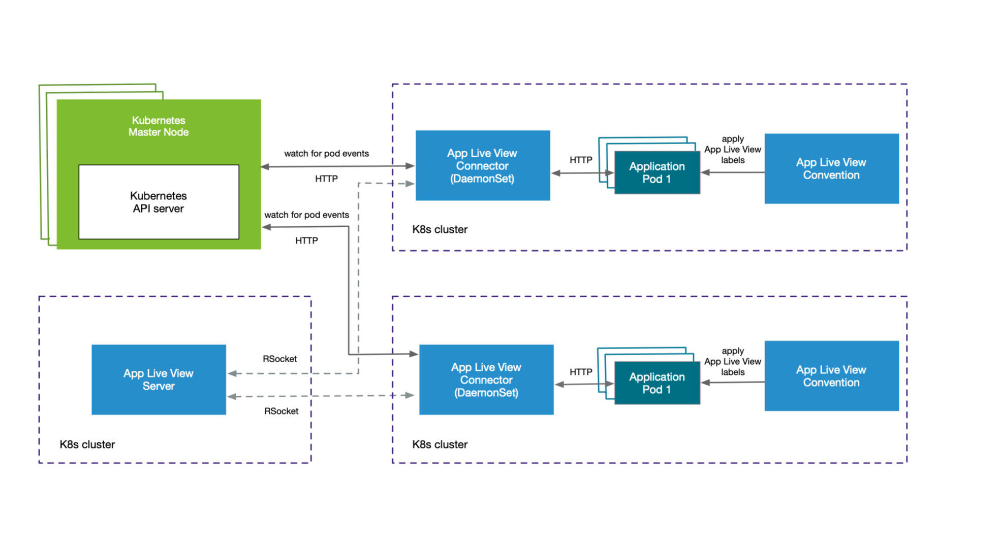

# Application Live View internal architecture

This topic describes the architecture of Application Live View and its components.
You can deploy this system on a Kubernetes stack and use it to monitor containerized
apps on hosted cloud platforms or on-premises.

##  Component overview

Application Live View includes the following components as shown in the architecture diagram:

- **Application Live View server**

  Application Live View server is the central server component that contains a list of registered apps. It is responsible for proxying the request to fetch the actuator information related to the app.

- **Application Live View connector**

  Application Live View connector is the component responsible for discovering the app pods running on the Kubernetes cluster, and registering the instances to the Application Live View server for it to be observed. The Application Live View connector is also responsible for proxying the actuator queries to the app pods running in the Kubernetes cluster.

  You can deploy Application Live View connector in two modes:

    * `Cluster access`: Deploy as a Kubernetes DaemonSet to discover apps across all the namespaces running in a worker node of a Kubernetes cluster. This is the default mode of Application Live View connector.

    * `Namespace scoped`: Deploy as a Kubernetes Deployment to discover apps running within a namespace across worker nodes of Kubernetes cluster.

- **Application Live View convention server**

  This component provides a webhook handler for the Tanzu convention controller. The webhook handler is registered with Tanzu convention controller. The webhook handler detects supply-chain workloads running a Spring Boot. Such workloads are annotated automatically to enable Application Live View to monitor them. Download and install the Application Live View conventions Webhook component with [Tanzu Application Platform](https://network.tanzu.vmware.com/products/tanzu-application-platform/).

- **Application Live View APIServer**

  Application Live View APIServer generates a unique token when a user receives access validation to a pod.
  The Application Live View connector component verifies the token against the Application Live View
  APIServer before proxying the actuator data from the application.
  This ensures that the actuator data is secured and only the user who has valid access to view the
  live information for the pod can retrieve the data.

##  Design flow

As illustrated in the diagram, the applications run by the user are registered with Application Live View server by using
Application Live View connector. After the application is registered, the Application Live View server offers the ability
to serve actuator data from that registered application through its REST API. Application Live View server proxies the call
to the connector for querying actuator endpoint information.

Application Live View connector, which is a lean model, uses specific labels to discover apps across cluster or namespace.
Application Live View connector serves as the connection between running applications and Application Live View server.
Application Live View connector communicates with the Kubernetes API server requesting events for pod creation and termination, and then filters out the events to find the pod of interest by using labels. Then Application Live View connector
registers the filtered app instances with Application Live View server.

Application Live View server and Application Live View connector communicate through a bidirectional RSocket channel. Application Live View connector is implemented as a
Java/Spring Boot application and runs as a native executable file (Spring Native using GraalVM). Application Live View connector runs as a DaemonSet by default on every node in the cluster.

Application Live View conventions identifies PodIntents for pods that can serve actuator data and annotates the PodSpec with application-specific labels. Those labels are used by the Application Live View connector to identify running pods that can serve actuator data. Application Live View conventions reads the image metadata to determine the application-specific labels applied on the PodSpec.
